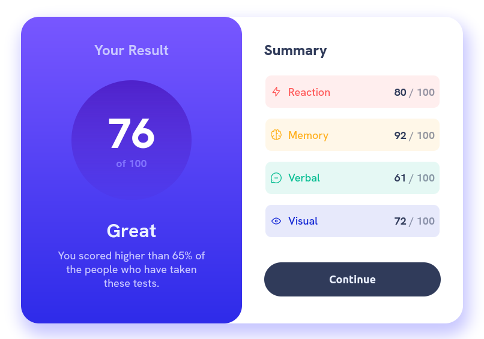
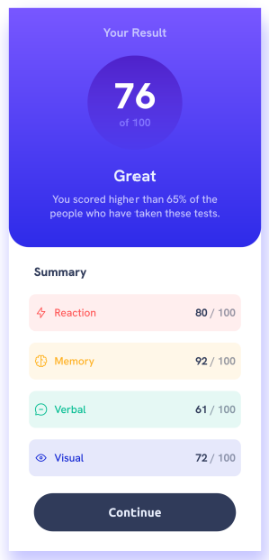

# Frontend Mentor - Results summary component solution

This is a solution to the [Results summary component challenge on Frontend Mentor](https://www.frontendmentor.io/challenges/results-summary-component-CE_K6s0maV).

## Table of contents

- [Overview](#overview)
  - [Screenshot](#screenshot)
  - [Links](#links)
- [My process](#my-process)
  - [Built with](#built-with)
  - [What I learned](#what-i-learned)
  - [Continued development](#continued-development)
  - [Useful resources](#useful-resources)
- [Author](#author)
- [Acknowledgments](#acknowledgments)

## Overview

This beautiful challenge gave me the opportunity of pursuing pixel perfectness. I've tried to keep things simple by playing mainly with flexbox, while discovering design dimensions and colors using [Gimp](https://www.gimp.org/)'s measuring tool and color picker. This workflow led me to a very satisfactory result.

### Screenshots

### Links

- Solution URL: [solution URL](https://your-solution-url.com)
- Live Site URL: [live site URL](https://your-live-site-url.com)

## My process

### Built with

- HTML
- CSS/Flexbox

## Author

- Website - [Paulo Wells](https://www.paulowells.com)
- Frontend Mentor - [@wellspr](https://www.frontendmentor.io/profile/wellspr)
- Twitter - [@paulo_wells](https://www.twitter.com/paulo_wells)

## Acknowledgments

Special thanks for [frontendmentor.io](https://www.frontendmentor.io/home) for putting these challenges forward.